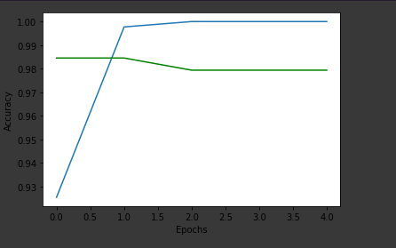
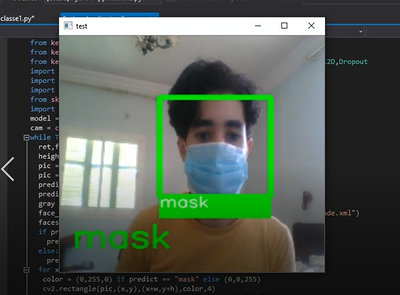
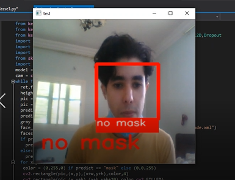

# Face Mask Detection
 # Requirements
 - **Numpy** :

```
pip install numpy
```
- **Keras** :

```
pip install keras
```
- **Tensorflow** :

```
pip install tensorflow
```
- **OpenCV** :

```
pip install python-opencv
```
  
# VGG16 Model Accuracy :
  
  
# Prediction Example :
  
  
 
